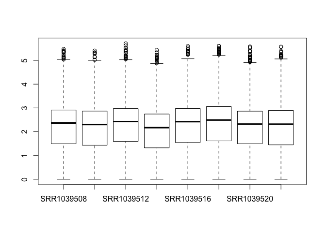
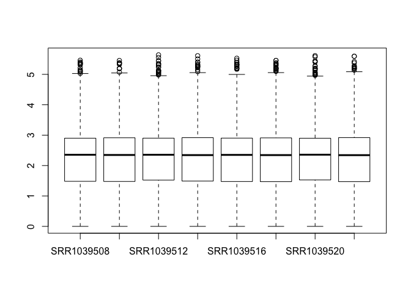
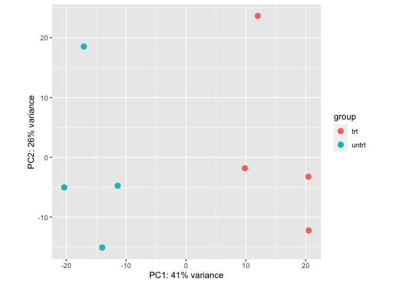
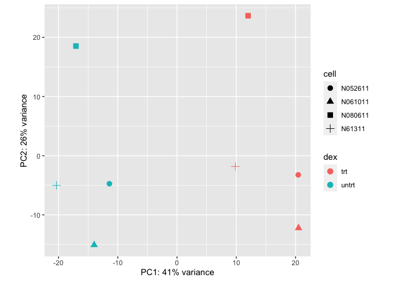
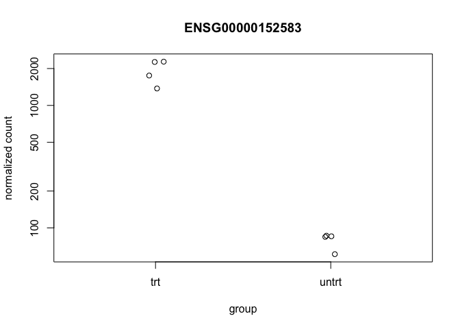
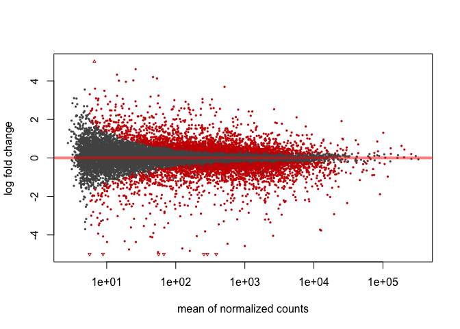
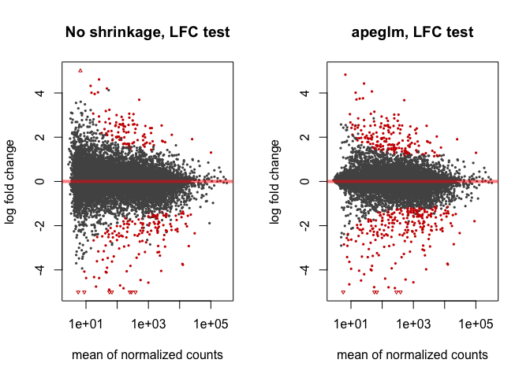

RNA seq Workflow
----------------

In this notebook, I perform gene-level exploratory analysis and
differential expression. Data and workflow is provided by Michael I.
Love1,2, Simon Anders3, Vladislav Kim4 and Wolfgang Huber.

Data for this gene-level expression analysis was prepared by Salmon -
counts were quantified based on the index created by Salmon. Salmon
tuorial can be found
[here](https://combine-lab.github.io/salmon/getting_started/).

Relative abundance of all known and annotated transcripts is quantified
without aligning reads - in this case, the counts are estimated.

[Here is the Salmon quantification
workflow:](https://bioconductor.github.io/BiocWorkshops/rna-seq-data-analysis-with-deseq2.html#preparing-data-for-deseq2)

1.  Create Index:

<!-- -->

    salmon index -i gencode.v99_salmon_0.10.0 -t gencode.v99.transcripts.fa.gz

1.  Quntify: Loop over this command for multiple samples.

<!-- -->

    salmon quant -i gencode.v99_salmon_0.10.0 -p 6 --libType A \
      --gcBias --biasSpeedSamp 5 \
      -1 sample_01_1.fastq.gz -2 sample_01_2.fastq.gz \
      -o sample_01

1.  Import into R with *tximport*

<!-- -->

    library(tximport)
    #BiocManager::install("tximportData")
    library(tximportData)

    dir <- system.file("extdata", package="tximportData")
    list.files(dir)

    ##  [1] "alevin"                  "cufflinks"              
    ##  [3] "kallisto"                "kallisto_boot"          
    ##  [5] "rsem"                    "sailfish"               
    ##  [7] "salmon"                  "salmon_dm"              
    ##  [9] "salmon_gibbs"            "samples_extended.txt"   
    ## [11] "samples.txt"             "tx2gene.csv"            
    ## [13] "tx2gene.ensembl.v87.csv" "tx2gene.gencode.v27.csv"

    list.files(file.path(dir,"salmon"))

    ## [1] "ERR188021" "ERR188088" "ERR188288" "ERR188297" "ERR188329" "ERR188356"

These identifiers are from European Nucleotide Archive. Read in the
samples

    samples <- read.table(file.path(dir,"samples.txt"), header=TRUE)
    samples

    ##   pop center                assay    sample experiment       run
    ## 1 TSI  UNIGE NA20503.1.M_111124_5 ERS185497  ERX163094 ERR188297
    ## 2 TSI  UNIGE NA20504.1.M_111124_7 ERS185242  ERX162972 ERR188088
    ## 3 TSI  UNIGE NA20505.1.M_111124_6 ERS185048  ERX163009 ERR188329
    ## 4 TSI  UNIGE NA20507.1.M_111124_7 ERS185412  ERX163158 ERR188288
    ## 5 TSI  UNIGE NA20508.1.M_111124_2 ERS185362  ERX163159 ERR188021
    ## 6 TSI  UNIGE NA20514.1.M_111124_4 ERS185217  ERX163062 ERR188356

    files <- file.path(dir, "salmon", samples$run, "quant.sf.gz")
    names(files) <- paste0("sample",1:6)
    all(file.exists(files))

    ## [1] TRUE

1.  Mapping transcripts to genes: We therefore will construct a
    data.frame called tx2gene with two columns: 1) transcript ID and 2)
    gene ID. The column names do not matter but this column order must
    be used. The transcript ID must be the same one used in the
    abundance files. This can most easily be accomplished by downloading
    the GTF file at the same time that the transcriptome FASTA is
    downloaded, and generating tx2gene from the GTF file using
    Bioconductor’s TxDb infrastructure.

<!-- -->

    #BiocManager::install("TxDb.Hsapiens.UCSC.hg38.knownGene")
    library("TxDb.Hsapiens.UCSC.hg38.knownGene")

    ## Loading required package: GenomicFeatures

    ## Loading required package: BiocGenerics

    ## Loading required package: parallel

    ## 
    ## Attaching package: 'BiocGenerics'

    ## The following objects are masked from 'package:parallel':
    ## 
    ##     clusterApply, clusterApplyLB, clusterCall, clusterEvalQ,
    ##     clusterExport, clusterMap, parApply, parCapply, parLapply,
    ##     parLapplyLB, parRapply, parSapply, parSapplyLB

    ## The following objects are masked from 'package:stats':
    ## 
    ##     IQR, mad, sd, var, xtabs

    ## The following objects are masked from 'package:base':
    ## 
    ##     anyDuplicated, append, as.data.frame, basename, cbind, colnames,
    ##     dirname, do.call, duplicated, eval, evalq, Filter, Find, get, grep,
    ##     grepl, intersect, is.unsorted, lapply, Map, mapply, match, mget,
    ##     order, paste, pmax, pmax.int, pmin, pmin.int, Position, rank,
    ##     rbind, Reduce, rownames, sapply, setdiff, sort, table, tapply,
    ##     union, unique, unsplit, which, which.max, which.min

    ## Loading required package: S4Vectors

    ## Loading required package: stats4

    ## 
    ## Attaching package: 'S4Vectors'

    ## The following object is masked from 'package:base':
    ## 
    ##     expand.grid

    ## Loading required package: IRanges

    ## Loading required package: GenomeInfoDb

    ## Loading required package: GenomicRanges

    ## Loading required package: AnnotationDbi

    ## Loading required package: Biobase

    ## Welcome to Bioconductor
    ## 
    ##     Vignettes contain introductory material; view with
    ##     'browseVignettes()'. To cite Bioconductor, see
    ##     'citation("Biobase")', and for packages 'citation("pkgname")'.

    txdb <- TxDb.Hsapiens.UCSC.hg38.knownGene
    k <- keys(txdb, keytype="TXNAME")
    tx2gene <- select(txdb, k, "GENEID", "TXNAME")

    ## 'select()' returned 1:1 mapping between keys and columns

    library(readr)
    tx2gene <- read_csv(file.path(dir, "tx2gene.gencode.v27.csv"))

    ## Parsed with column specification:
    ## cols(
    ##   TXNAME = col_character(),
    ##   GENEID = col_character()
    ## )

    head(tx2gene)

    ## # A tibble: 6 x 2
    ##   TXNAME            GENEID           
    ##   <chr>             <chr>            
    ## 1 ENST00000456328.2 ENSG00000223972.5
    ## 2 ENST00000450305.2 ENSG00000223972.5
    ## 3 ENST00000473358.1 ENSG00000243485.5
    ## 4 ENST00000469289.1 ENSG00000243485.5
    ## 5 ENST00000607096.1 ENSG00000284332.1
    ## 6 ENST00000606857.1 ENSG00000268020.3

“Finally the following line of code imports Salmon transcript
quantifications into R, collapsing to the gene level using the
information in tx2gene”

    library(tximport)
    library(jsonlite)
    library(readr)
    txi<- tximport(files, type = 'salmon', tx2gene = tx2gene)

    ## reading in files with read_tsv

    ## 1 2 3 4 5 6 
    ## summarizing abundance
    ## summarizing counts
    ## summarizing length

The txi object is simply a list of matrices (and one character vector):

    names(txi)

    ## [1] "abundance"           "counts"              "length"             
    ## [4] "countsFromAbundance"

    txi$counts[1:3, 1:3]

    ##                       sample1  sample2    sample3
    ## ENSG00000000003.14    2.58012    2.000   27.09648
    ## ENSG00000000005.5     0.00000    0.000    0.00000
    ## ENSG00000000419.12 1056.99960 1337.997 1452.99497

    txi$length[1:3, 1:3]

    ##                      sample1  sample2   sample3
    ## ENSG00000000003.14 3621.7000 735.4220 2201.6223
    ## ENSG00000000005.5   195.6667 195.6667  195.6667
    ## ENSG00000000419.12  871.5077 905.0540  845.7278

    txi$abundance[1:3, 1:3]

    ##                       sample1   sample2   sample3
    ## ENSG00000000003.14  0.0354884  0.119404  0.411491
    ## ENSG00000000005.5   0.0000000  0.000000  0.000000
    ## ENSG00000000419.12 60.4173800 64.909276 57.441353

    txi$countsFromAbundance

    ## [1] "no"

1.  Create a DESeq object

<!-- -->

    #BiocManager::install("DESeq2")
    library(DESeq2)

    ## Loading required package: SummarizedExperiment

    ## Loading required package: DelayedArray

    ## Loading required package: matrixStats

    ## 
    ## Attaching package: 'matrixStats'

    ## The following objects are masked from 'package:Biobase':
    ## 
    ##     anyMissing, rowMedians

    ## Loading required package: BiocParallel

    ## 
    ## Attaching package: 'DelayedArray'

    ## The following objects are masked from 'package:matrixStats':
    ## 
    ##     colMaxs, colMins, colRanges, rowMaxs, rowMins, rowRanges

    ## The following objects are masked from 'package:base':
    ## 
    ##     aperm, apply, rowsum

    dds <- DESeqDataSetFromTximport(txi, samples, ~1)

    ## using counts and average transcript lengths from tximport

    dds$center

    ## [1] UNIGE UNIGE UNIGE UNIGE UNIGE UNIGE
    ## Levels: UNIGE

    dds$pop

    ## [1] TSI TSI TSI TSI TSI TSI
    ## Levels: TSI

Exploratory data analysis:
--------------------------

    library(airway)
    data("airway")

    airway$index<- relevel(airway$dex, "untrt")
    airway$dex

    ## [1] untrt trt   untrt trt   untrt trt   untrt trt  
    ## Levels: trt untrt

We can quickly check the millions of fragments that uniquely aligned to
the genes (the second argument of round tells how many decimal points to
keep)

    round( colSums(assay(airway)) / 1e6, 1 )

    ## SRR1039508 SRR1039509 SRR1039512 SRR1039513 SRR1039516 SRR1039517 SRR1039520 
    ##       20.6       18.8       25.3       15.2       24.4       30.8       19.1 
    ## SRR1039521 
    ##       21.2

    colData(airway)

    ## DataFrame with 8 rows and 10 columns
    ##            SampleName     cell      dex    albut        Run avgLength
    ##              <factor> <factor> <factor> <factor>   <factor> <integer>
    ## SRR1039508 GSM1275862   N61311    untrt    untrt SRR1039508       126
    ## SRR1039509 GSM1275863   N61311      trt    untrt SRR1039509       126
    ## SRR1039512 GSM1275866  N052611    untrt    untrt SRR1039512       126
    ## SRR1039513 GSM1275867  N052611      trt    untrt SRR1039513        87
    ## SRR1039516 GSM1275870  N080611    untrt    untrt SRR1039516       120
    ## SRR1039517 GSM1275871  N080611      trt    untrt SRR1039517       126
    ## SRR1039520 GSM1275874  N061011    untrt    untrt SRR1039520       101
    ## SRR1039521 GSM1275875  N061011      trt    untrt SRR1039521        98
    ##            Experiment    Sample    BioSample    index
    ##              <factor>  <factor>     <factor> <factor>
    ## SRR1039508  SRX384345 SRS508568 SAMN02422669    untrt
    ## SRR1039509  SRX384346 SRS508567 SAMN02422675      trt
    ## SRR1039512  SRX384349 SRS508571 SAMN02422678    untrt
    ## SRR1039513  SRX384350 SRS508572 SAMN02422670      trt
    ## SRR1039516  SRX384353 SRS508575 SAMN02422682    untrt
    ## SRR1039517  SRX384354 SRS508576 SAMN02422673      trt
    ## SRR1039520  SRX384357 SRS508579 SAMN02422683    untrt
    ## SRR1039521  SRX384358 SRS508580 SAMN02422677      trt

    table(airway$cell)

    ## 
    ## N052611 N061011 N080611  N61311 
    ##       2       2       2       2

    table(airway$dex)

    ## 
    ##   trt untrt 
    ##     4     4

Create a DESeqDataSet, where we control for the cell line, while testing
for differences accross dexamethasone treatment:

    dds <- DESeqDataSet(airway, design = ~ cell + dex)

Minimal filtering to reduce hte size of the dataset:

    keep<- rowSums(counts(dds) >= 5) >= 4
    table(keep)

    ## keep
    ## FALSE  TRUE 
    ## 46070 18032

    dds<- dds[keep, ]

Exploratory analysis of the counts for each sample:

    boxplot(log10(counts(dds)+1))

“The main function in DESeq2 involves computation of size factors which
normalize for differences in sequencing depth among samples. We can also
compute these size factors manually, so that the normalized counts are
available for plotting:”

    dds <- estimateSizeFactors(dds)
    boxplot(log10(counts(dds,normalized=TRUE)+1))

Normalization:
--------------

Taking the logarithm of counts plus a pseudocount of 1 is a common
transformation, but it tends to **inflate the sampling variance of low
counts** such that it is even larger than biological variation across
groups of samples. In DESeq2 we therefore provide transformations which
produce **log-scale data such that the systematic trends have been
removed**. Our recommended transformation is the **variance-stabilizing
transformation**, or VST, and it can be called with the vst function

    vsd <- vst(dds)
    class(vsd)

    ## [1] "DESeqTransform"
    ## attr(,"package")
    ## [1] "DESeq2"

The return of this function is continuous values - these values can be
accessed with the assay:

    assay(vsd)[1:3, 1:3]

    ##                 SRR1039508 SRR1039509 SRR1039512
    ## ENSG00000000003   9.456925   9.074623   9.608160
    ## ENSG00000000419   8.952752   9.262092   9.145782
    ## ENSG00000000457   8.193711   8.098664   8.032656

Principle component analysis:
-----------------------------

Now that the data is normalized, we can perform the PCA.

    plotPCA(vsd, 'dex')

    library("ggplot2")
    pcaData <- plotPCA(vsd, intgroup = c( "dex", "cell"), returnData = TRUE)
    percentVar <- round(100 * attr(pcaData, "percentVar"))
    ggplot(pcaData, aes(x = PC1, y = PC2, color = dex, shape = cell)) +
      geom_point(size =3) +
      xlab(paste0("PC1: ", percentVar[1], "% variance")) +
      ylab(paste0("PC2: ", percentVar[2], "% variance")) +
      coord_fixed()

Differential Expressoin Steps:
------------------------------

    dds<- DESeq(dds)

    ## using pre-existing size factors

    ## estimating dispersions

    ## gene-wise dispersion estimates

    ## mean-dispersion relationship

    ## final dispersion estimates

    ## fitting model and testing

    res<- results(dds)

The results table res contains the results for each gene (in the same
order as in the DESeqDataSet). If we want to see the top genes, we can
order it like so:

    head(res[order(res$pvalue), ])

    ## log2 fold change (MLE): dex untrt vs trt 
    ## Wald test p-value: dex untrt vs trt 
    ## DataFrame with 6 rows and 6 columns
    ##                         baseMean    log2FoldChange             lfcSE
    ##                        <numeric>         <numeric>         <numeric>
    ## ENSG00000152583 997.522193389904 -4.57431691312792  0.18393437345052
    ## ENSG00000165995 495.289924523775 -3.29060361545764 0.132397966518453
    ## ENSG00000120129 3409.85238036378 -2.94725076974395 0.122471862238876
    ## ENSG00000101347  12707.320121355 -3.76640407186187 0.156934462058286
    ## ENSG00000189221 2342.17328482568 -3.35311241946994 0.142537621022757
    ## ENSG00000211445 12292.1234547129 -3.72983436283866 0.167361535158863
    ##                              stat                pvalue                  padj
    ##                         <numeric>             <numeric>             <numeric>
    ## ENSG00000152583 -24.8692880363575 1.59966393682854e-136 2.03443550834331e-132
    ## ENSG00000165995  -24.853883348722  2.3476061716401e-136 2.03443550834331e-132
    ## ENSG00000120129 -24.0647175266713 5.85513803624476e-128 3.38270841480647e-124
    ## ENSG00000101347 -23.9998533302584 2.79060701664288e-127 1.20917002031136e-123
    ## ENSG00000189221 -23.5244028587695 2.29558527338039e-122 7.95741679164578e-119
    ## ENSG00000211445  -22.286090763318 5.04139079476578e-110 1.45628975424801e-106

PLotting counts for the top genes:

    plotCounts(dds, which.min(res$pvalue), "dex")

We can examine all the log2 fold changes (LFC) due to dexamethasone
treatment over the mean of counts using plotMA:

    plotMA(res, ylim = c(-5,5))

Apply LFC shrinkage

    #BiocManager::install("apeglm")
    library(apeglm)
    resultsNames(dds)

    ## [1] "Intercept"               "cell_N061011_vs_N052611"
    ## [3] "cell_N080611_vs_N052611" "cell_N61311_vs_N052611" 
    ## [5] "dex_untrt_vs_trt"

    res2 <- lfcShrink(dds, coef="dex_untrt_vs_trt", type="apeglm")

    ## using 'apeglm' for LFC shrinkage. If used in published research, please cite:
    ##     Zhu, A., Ibrahim, J.G., Love, M.I. (2018) Heavy-tailed prior distributions for
    ##     sequence count data: removing the noise and preserving large differences.
    ##     Bioinformatics. https://doi.org/10.1093/bioinformatics/bty895

    par(mfrow=c(1,2))
    plotMA(res, ylim=c(-3,3), main="No shrinkage")
    plotMA(res2, ylim=c(-3,3), main="apeglm")

Minimum effect size:
--------------------

Set up a minimum biologically meaningful effect size and test against
it.

    res.lfc <- results(dds, lfcThreshold=1)
    names(res.lfc)

    ## [1] "baseMean"       "log2FoldChange" "lfcSE"          "stat"          
    ## [5] "pvalue"         "padj"

    res.lfc2 <- lfcShrink(dds, coef="dex_untrt_vs_trt", type="apeglm",
                          lfcThreshold=1)

    ## using 'apeglm' for LFC shrinkage. If used in published research, please cite:
    ##     Zhu, A., Ibrahim, J.G., Love, M.I. (2018) Heavy-tailed prior distributions for
    ##     sequence count data: removing the noise and preserving large differences.
    ##     Bioinformatics. https://doi.org/10.1093/bioinformatics/bty895

    ## computing FSOS 'false sign or small' s-values (T=1)

Note that testing against an LFC threshold is not equivalent to testing
against a null hypothesis of 0 and then filtering on LFC values.

    par(mfrow=c(1,2))
    plotMA(res.lfc, ylim=c(-5,5), main="No shrinkage, LFC test")
    plotMA(res.lfc2, ylim=c(-5,5), main="apeglm, LFC test", alpha=0.01)

Annotation Hub:
---------------

    library(AnnotationHub)
    ah <<- AnnotationHub()

    query(ah, c("OrgDb","Homo sapiens"))

    ## AnnotationHub with 1 record
    ## # snapshotDate(): 2019-05-02 
    ## # names(): AH70572
    ## # $dataprovider: ftp://ftp.ncbi.nlm.nih.gov/gene/DATA/
    ## # $species: Homo sapiens
    ## # $rdataclass: OrgDb
    ## # $rdatadateadded: 2019-04-29
    ## # $title: org.Hs.eg.db.sqlite
    ## # $description: NCBI gene ID based annotations about Homo sapiens
    ## # $taxonomyid: 9606
    ## # $genome: NCBI genomes
    ## # $sourcetype: NCBI/ensembl
    ## # $sourceurl: ftp://ftp.ncbi.nlm.nih.gov/gene/DATA/, ftp://ftp.ensembl.org/p...
    ## # $sourcesize: NA
    ## # $tags: c("NCBI", "Gene", "Annotation") 
    ## # retrieve record with 'object[["AH70572"]]'

Building Reports
----------------

    #BiocManager::install("ReportingTools")
    library(ReportingTools)

    ## Loading required package: knitr

    ## 

    ## Registered S3 method overwritten by 'GGally':
    ##   method from   
    ##   +.gg   ggplot2

    ## 

    tmp <- tempdir() # you would instead use a meaningful path here
    rep <- HTMLReport(shortName="airway", title="Airway DGE",
                      basePath=tmp, reportDirectory="report")
    publish(res, rep, dds, n=20, make.plots=TRUE, factor=dds$dex)
    finish(rep)

    ## [1] "/var/folders/kp/ysy8n1l97bq5787g2vx8mhsh0000gn/T//RtmpJnmIRj/report/airway.html"

    browseURL(file.path(tmp,"report","airway.html"))
